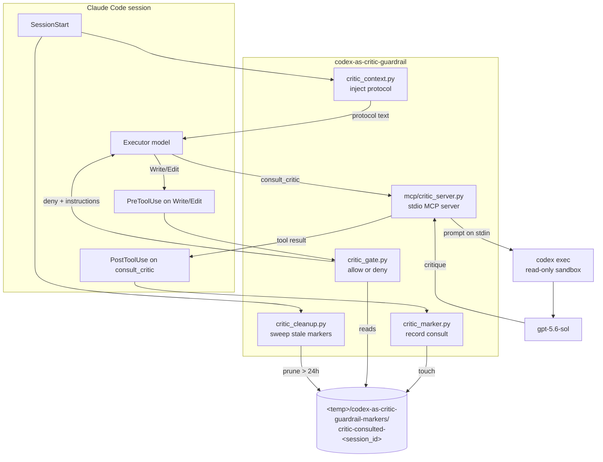

# codex-as-critic-guardrail — Technical Report

A complete breakdown of what this plugin is, how every piece works, how it is
tested, what it depends on, and where it can still fail.

Report date: 10 August 2026. Corresponds to plugin state at commit `3d99482`.
The user-facing summary lives in [README.md](README.md); this document is the
engineering detail behind it.

---

## 1. What the plugin is for

Language models from the same family share blind spots. An Opus executor asking
an Opus advisor for a second opinion gets a *fluent* second opinion, but not
necessarily an *independent* one — both models were trained on overlapping data
with overlapping conventions, so both tend to miss the same things.

This plugin exists to break that correlation. It forces a Claude Code session to
consult a critic that lives outside the Claude family entirely — `gpt-5.6-sol`,
reached through the user's already-authenticated Codex CLI — and it makes that
consultation *mandatory* rather than advisory by refusing the session's first
file write until the consultation has happened.

Two design commitments follow from that purpose and explain most of the code:

1. **The critic is antagonistic, not helpful.** Its prompt tells it to attack.
   The value is in objections, not agreement.
2. **The gate is deterministic, not persuasive.** A hook denies the write. The
   model cannot talk its way past a hook, which is the whole point of putting
   the enforcement in the harness rather than in a prompt.

---

## 2. At a glance

| Property | Value |
| --- | --- |
| Plugin name | `codex-as-critic-guardrail` (formerly `critic-guardrail`) |
| Marketplace | `agentic-rails`, category `guardrail` |
| Host tool | Claude Code and Cursor (no `.codex-plugin/` manifest) |
| MCP tool exposed | `consult_critic` |
| Critic model | `gpt-5.6-sol`, reasoning effort `high` |
| Transport | stdio JSON-RPC 2.0, UTF-8 |
| Third-party packages | **none** — Python standard library only |
| External binary | `codex` (must be on `PATH`, must be signed in) |
| Files | 15 (7 production Python, 2 test Python, 3 JSON, 3 Markdown) |
| Production Python | 546 lines (including a 13-line Apache header per file) |
| Test Python | 346 lines, 30 tests |
| Consult latency | median 51s, p90 132s, longest observed success 178s |
| Default consult cap | 600s, overridable |

---

## 3. Architecture

Four independent mechanisms cooperate. None of them calls another directly —
they coordinate entirely through **marker files in the system temp directory**,
which is what makes each one individually testable and individually failable.



### Why marker files rather than in-process state

Hooks are separate short-lived processes. Claude Code spawns a fresh Python
interpreter for each hook invocation, so there is no shared memory to hold "has
this session consulted yet". A file keyed by `session_id` is the simplest
durable answer, and putting it in the system temp directory (rather than the
target project) means the guardrail needs no `.gitignore` entry in every
repository that adopts it.

The cost is that markers accumulate, which is why `critic_cleanup.py` exists.

---

## 4. Component breakdown

### 4.1 `mcp/critic_server.py` — the MCP server (260 lines)

A hand-written JSON-RPC 2.0 server over stdio. No MCP SDK is used; the protocol
surface needed here is four methods, and avoiding a dependency keeps the plugin
installable anywhere Python runs.

**Module layout, in dependency order:**

| Symbol | Responsibility |
| --- | --- |
| `timeout_seconds()` | Reads `CODEX_CRITIC_TIMEOUT_SECONDS`, falls back to 600 on absent/zero/junk |
| `validate_arguments()` | Enforces the five-field contract and the stage enum; raises `ValueError` |
| `build_prompt()` | Wraps the payload in the adversarial persona instructions |
| `command()` | Resolves `codex` on PATH and builds the exact argv |
| `classify_failure()` | Turns Codex stderr into an actionable message (auth / model / generic) |
| `describe_timeout()` | Timeout message including Codex's partial output |
| `consult()` | Runs Codex as a subprocess and returns the critique |
| `TOOL` | The `tools/list` schema, including per-field descriptions |
| `response()` | JSON-RPC envelope builder |
| `negotiate_protocol_version()` | Echoes the client's version if supported |
| `dispatch()` | Routes one message; returns `None` when no reply is owed |
| `utf8_writer()` | Re-wraps stdout as UTF-8 |
| `handle()` | Parses one line and converts any exception into an error response |
| `main()` | The read loop |

**The design rule that shapes this file: the server must never die.**

A stdio MCP server that exits mid-call leaves the client with an unanswered
request. Claude Code will not notice for 30 minutes (its stdio idle timeout),
and to a user that looks exactly like "it hung". So every layer is defensive:

- `main()` reads **bytes** and decodes each line individually, so one line of
  invalid UTF-8 becomes a `-32700` and the next line still parses.
- `handle()` catches `Exception` at the top-level boundary and returns `-32603`.
  This is the one place a blind catch is correct: the alternative is death.
- `dispatch()` catches `ValueError`/`RuntimeError` from the consult path and
  returns them as `isError: true` tool results rather than protocol errors, so
  the model reads the message and self-corrects.

**Protocol conformance:**

| Message | Behavior |
| --- | --- |
| `initialize` | Echoes the client's `protocolVersion` when it is one of `2025-06-18`, `2025-03-26`, `2024-11-05`; otherwise the newest |
| `ping` | Empty result `{}` — required by spec |
| `tools/list` | The single `consult_critic` tool |
| `tools/call` | Runs the consult, or returns `-32601` for an unknown tool name |
| any message with no `id` | **No reply at all** — it is a notification, and JSON-RPC forbids answering one |
| anything else with an `id` | `-32601 Method not found` |

### 4.2 The Codex invocation

```
codex exec --ephemeral --skip-git-repo-check --sandbox read-only \
      --model gpt-5.6-sol -c model_reasoning_effort="high" -
```

Every flag is load-bearing:

| Flag | Why |
| --- | --- |
| `exec` | Non-interactive. An interactive session would block forever on stdin. |
| `--ephemeral` | No session persistence; each consult is independent. |
| `--skip-git-repo-check` | Codex refuses to start outside a git repository without it. Omitting it made the critic **totally unusable** in non-git workspaces. |
| `--sandbox read-only` | The critic can read the repository to test a claim, but cannot modify it. This is the security boundary. |
| `--model gpt-5.6-sol` | The whole point: a non-Claude model. |
| `-c model_reasoning_effort="high"` | Critique quality depends on reasoning depth; this is the main latency driver. |
| `-` | Read the prompt from stdin, avoiding argv length limits and shell quoting. |

The subprocess inherits the **executor's working directory** (`cwd=workspace or
os.getcwd()`), which is what lets the critic inspect the repository under
review. `.mcp.json` deliberately sets no `cwd`, and a test asserts that.

### 4.3 The hooks (`hooks/`)

All four are launched by the same one-line `python -c` shim in `hooks.json`,
which puts the plugin's `hooks/` directory on `sys.path` and then `runpy`s the
target file. This is what allows the hook modules to import each other.

| Hook | Event | Matcher | Behavior |
| --- | --- | --- | --- |
| `critic_gate.py` | `PreToolUse` | `^(Write\|Edit\|MultiEdit\|NotebookEdit)$` | Denies with instructions unless a marker exists |
| `critic_marker.py` | `PostToolUse` | `.*consult_critic$` | Touches the session marker |
| `critic_cleanup.py` | `SessionStart` | — | Deletes markers older than 24h, including from former plugin names |
| `critic_context.py` | `SessionStart` | — | Prints `critic-protocol.md` into session context |

Two shared modules support them:

- **`critic_markers.py`** owns the marker path scheme. `MARKER_DIR_NAMES` is an
  ordered tuple whose first entry is current and whose remaining entries are
  historical, so a rename never strands files in temp.
- **`critic_streams.py`** provides `force_utf8()`, which reconfigures stdio to
  UTF-8 and silently skips streams that cannot be reconfigured (a `StringIO`
  substituted by a test, for instance).

**Every hook fails open.** A malformed payload, a missing protocol file, or an
unreadable marker directory results in `sys.exit(0)`, never a blocked session.
A guardrail that bricks the tool when it malfunctions is worse than no
guardrail.

### 4.4 `critic-protocol.md` — the behavioral contract

Injected into context at `SessionStart`. It is the only part of the system that
tries to *persuade* rather than *enforce*, and it does three jobs: it tells the
executor when to consult, it specifies the five-field payload, and — most
importantly — it tells the executor how to *treat* an objection:

> Test each objection against the evidence. If evidence contradicts the
> critique, run one reconcile consult.

This matters because an adversarial critic will sometimes be wrong, and a
suggestible executor that simply obeys every objection is worse than one that
never consulted.

---

## 5. The consult contract

`consult_critic` requires five non-empty string fields. The critic sees **only
this payload plus the readable workspace** — never the executor's transcript.

| Field | Purpose |
| --- | --- |
| `task` | One-paragraph statement of the overall task |
| `stage` | One of `planning`, `stuck`, `pivot-check`, `completion-review` |
| `approach` | The plan being followed, or the approach taken |
| `evidence` | File paths, errors, test output, discovered constraints |
| `question` | The specific decision or verdict wanted |

Validation is strict and deliberately unhelpful to lazy callers: a missing or
whitespace-only field is rejected before Codex is launched. Field logs show 5
such rejections in production, all self-corrected by the model on retry. Since
the fix, each field also carries a `description` in the tool schema, which
should reduce those.

An invalid `stage` echoes the received value back. That serves the caller, and
it doubles as the one place a payload is reflected verbatim across the
transport — which the encoding test exploits.

---

## 6. Lifecycle walkthrough

**Session start.** Two hooks fire. `critic_cleanup.py` prunes markers older
than 24 hours (from the current directory and any former one). `critic_context.py`
prints the protocol to stdout, and Claude Code appends that to session context.

**First write attempt.** The executor tries `Write`. `critic_gate.py` reads the
hook payload, extracts `session_id`, finds no marker, and emits a
`permissionDecision: deny` whose reason explains exactly what to call. The
executor reads that and self-corrects.

**The consult.** The executor calls `consult_critic`. The server validates,
builds the prompt, and runs `codex exec` in the executor's working directory.
Codex reasons — typically 30–130 seconds — optionally reading repository files,
then returns a critique of at most 120 words. The server strips it and returns
it as a tool result.

**Unlocking.** `critic_marker.py` fires on `PostToolUse`, matches the tool name
(plain or MCP-namespaced), and touches `critic-consulted-<session_id>`.

**Subsequent writes.** `critic_gate.py` finds the marker and exits 0 silently.
The gate is **per session, not per task** — one consult unlocks the rest of the
session.

---

## 7. Error taxonomy

Every failure is returned as a tool error with actionable text, never as a
silent failure or a crash.

| Condition | Message | What the user must do |
| --- | --- | --- |
| `codex` not on PATH | "Codex executable not found on PATH…" | Install Codex, sign in |
| Not signed in | "Codex authentication failed; sign in…" | `codex login` |
| Model unavailable | "Critic model gpt-5.6-sol is unavailable…" | Check account/Codex version |
| Consult exceeded cap | "Codex critic timed out after N seconds…" + partial output | Raise `CODEX_CRITIC_TIMEOUT_SECONDS` |
| Codex ran but said nothing | "Codex critic returned no critique." | Investigate Codex |
| Missing/blank fields | "missing or empty required field(s): …" | Model retries with full payload |
| Bad stage | "stage must be one of: …; received: X" | Model retries |
| Malformed JSON on stdin | `-32700` | Client bug |
| Invalid UTF-8 on stdin | `-32700 stdin is not valid UTF-8` | Client bug |
| Unexpected internal error | `-32603 Internal critic server error` | File a bug — server stays alive |

---

## 8. Configuration surface

Deliberately tiny. One environment variable:

```jsonc
// .claude/settings.json
{ "env": { "CODEX_CRITIC_TIMEOUT_SECONDS": "900" } }
```

Absent, zero, negative, or non-numeric values all fall back to 600 seconds.

Everything else — model, reasoning effort, sandbox mode, the persona, the gated
tools — is fixed in code. That is a deliberate choice: a guardrail with a rich
configuration surface is a guardrail that gets configured into uselessness.

---

## 9. Security and trust posture

**What the plugin can do:** execute bundled Python on hook events, and start the
locally authenticated Codex CLI.

**What the critic can do:** read files in the executor's working directory.

**What the critic cannot do:** write, delete, or execute anything that modifies
state — enforced by `--sandbox read-only` at the Codex layer, not by prompt.

**Credentials:** none are read, stored, or transmitted by this plugin. It uses
the Codex CLI's existing login. There is no API key handling code anywhere in
the plugin, by design.

**Network egress:** indirect only, via Codex to OpenAI. The payload sent
off-machine is the five fields plus whatever repository content the critic
chooses to read. **Treat a consult as disclosing that content to OpenAI** — do
not use this plugin in a repository whose contents cannot leave the machine.

**Trust prompts on install are expected** and should not be waved through
blindly: the plugin runs code on hook events and spawns a subprocess.

**Marker files** contain no content — only an empty file whose name embeds the
session ID. They are world-readable in the system temp directory. A local
attacker able to write there could forge a marker and unlock the gate; this is
not defended against, and the gate is not a security boundary. It is a
discipline mechanism.

---

## 10. How it is tested

### 10.1 Test strategy

The suite is deliberately split into two layers, because the plugin's history
proved that one layer alone gives false confidence.

**Layer 1 — unit tests against imported functions** (`CriticServerTests`,
`HookTests`). Fast, hermetic, no subprocess. These cover argument validation,
prompt construction, command construction, error classification, timeout
configuration, JSON-RPC routing, and hook decisions. Codex is always mocked.

**Layer 2 — real subprocess tests** (`StdioTransportTests`, plus the
SessionStart hook test). These spawn the actual server or the actual hook
launcher and speak to it over real pipes. They exist because **every defect that
reached production lived in code the unit tests never executed** — `main()`, the
stdio read loop, and the hook launcher. Codex is never invoked: the tests use
inputs that fail validation before the subprocess is launched, which keeps them
hermetic and fast while still exercising the whole transport.

Total: **30 tests, ~0.6s**, zero network calls, zero Codex quota consumed.

### 10.2 What each test protects

**Transport and protocol (`StdioTransportTests`, 4 tests)**

| Test | Protects |
| --- | --- |
| `test_handshake_over_real_stdio` | initialize → notification → tools/list → ping over real pipes; asserts the notification draws no reply |
| `test_non_ascii_payload_survives_the_transport_intact` | Curly quotes, dashes, accents, and emoji arrive byte-exact |
| `test_malformed_and_blank_lines_do_not_kill_the_server` | Unknown methods return `-32601` and the server keeps serving |
| `test_garbage_input_draws_a_parse_error_and_the_server_continues` | Invalid UTF-8 and non-JSON produce `-32700`, then a later valid request still succeeds |

**Codex invocation (4 tests)** — the exact argv, the presence of
`--skip-git-repo-check`, workspace propagation, and the actionable
missing-executable error.

**Timeout behavior (3 tests)** — that the default clears the observed latency
distribution, that the env var is honored and junk ignored, and that a timeout
message names the variable and carries Codex's partial output.

**Contract and schema (4 tests)** — five-field validation, the stage enum, the
adversarial persona in the prompt, and a `description` on every schema field.

**JSON-RPC semantics (6 tests)** — server name, protocol negotiation, `ping`
returning `{}`, notifications never answered, unknown tool, and bad payloads
surfacing as tool errors rather than crashes.

**Hooks (9 tests)** — gate denies then allows, marker creation for both plain
and MCP-namespaced tool names, non-matching tools ignored, malformed payloads
ignored, stale marker cleanup, legacy directory sweeping, hook matcher shapes,
and UTF-8 protocol injection through the real launcher.

### 10.3 Mutation testing — proof the tests actually bite

A passing test proves nothing if it would also pass against the broken code.
Both encoding fixes were verified by reintroducing the original defect and
confirming the relevant test fails:

| Mutation | Test | Observed failure |
| --- | --- | --- |
| Decode stdin as `cp1252`/`surrogateescape` | `test_non_ascii_payload_survives_the_transport_intact` | Payload arrived as `'“critic\udc9d — naïve caché'` — the exact production corruption |
| Remove `force_utf8()` from `critic_context.py` | `test_session_start_injects_the_protocol_as_utf8` | `UnicodeDecodeError: 'utf-8' codec can't decode byte 0x97` — the cp1252 em dash |

### 10.4 What is *not* tested, and why

Stated plainly so nobody mistakes 30 green tests for full coverage:

- **No test invokes Codex.** Every consult path is mocked. Real behavior was
  verified manually (§11) and is re-verified by hand after changes to
  `command()` or `consult()`.
- **The 600s timeout is never reached in tests.** It is exercised via a mocked
  `TimeoutExpired`. Waiting 600 seconds in a suite would be indefensible.
- **No Linux or macOS run.** Every encoding fix targets a Windows-specific
  default; on a UTF-8 platform these tests pass trivially and prove less.
- **Critique quality is not tested.** Whether the critic gives *good* objections
  is not machine-checkable and is not attempted.
- **Concurrency is untested** because the server is single-threaded by design
  and the write gate only ever asks for one consult at a time.

### 10.5 Running the suite

```bash
cd plugins/codex-as-critic-guardrail
python -m unittest discover -s tests        # 30 tests, ~0.6s
claude plugin validate .                     # from the repo root
```

`unittest` is used rather than `pytest` deliberately: it ships with Python, so
the plugin's tests run anywhere the plugin itself runs.

---

## 11. Measured performance

Derived from Claude Code's own MCP logs across 12 working directories — 111
logged tool calls, of which 96 succeeded.

| Metric | Value |
| --- | --- |
| Median consult | 51s |
| p90 | 132s |
| Longest success | 178s |
| Calls over 60s | 36 of 96 |
| Calls over 120s | 13 of 96 |

Latency tracks repository size and unfamiliarity far more than payload size:

| Workspace | n | Median | Max |
| --- | --- | --- | --- |
| `FoodYou` | 23 | 91s | 178s |
| `FoodUs-Server` | 8 | 123s | 162s |
| `block-game-2` | 4 | 53s | 135s |
| `mega-markdown` | 10 | 36s | 97s |
| `agentic_rails` | 4 | 42s | 45s |
| `tech-support` | 10 | 33s | 58s |

This distribution is the entire justification for the 600s cap. The previous
180s cap sat *inside* it.

---

## 12. Software Bill of Materials

### 12.1 Headline

**This plugin has zero third-party package dependencies.** Every import resolves
to the Python standard library or to another file in this plugin. There is no
`requirements.txt`, no `pyproject.toml`, no lock file, and no vendored code,
because there is nothing to pin. The supply-chain attack surface is the Python
interpreter, the Codex CLI, and Claude Code itself.

### 12.2 Components

| Component | Version | Type | Supplier | License | Relationship |
| --- | --- | --- | --- | --- | --- |
| `codex-as-critic-guardrail` | commit `3d99482` | This plugin | Jarryd Adaens | Apache-2.0 | root |
| CPython | 3.14.6 (verified) | Runtime | Python Software Foundation | PSF-2.0 | required, direct |
| Codex CLI (`codex`) | 0.147.0 (verified) | External binary | OpenAI | Not verified — no license file ships with the Windows build; upstream `openai/codex` is Apache-2.0. Confirm before redistributing. | required, direct |
| Claude Code | 2.1.220 (verified) | Host application | Anthropic | Proprietary | required, host |
| `gpt-5.6-sol` | n/a | Hosted model | OpenAI | Service terms | required, transitive via Codex |

Versions above are those verified on the development machine on 10 Aug 2026.
The plugin pins none of them; it degrades with an actionable error message when
`codex` is absent, unauthenticated, or lacks the model.

### 12.3 Standard library modules used

| Module | Used by | Purpose |
| --- | --- | --- |
| `subprocess` | server | Launch Codex; the only process-spawning surface |
| `json` | server, hooks | JSON-RPC and hook payload encoding |
| `io` | server | UTF-8 stdout wrapping |
| `sys` | server, hooks | stdio access, exit codes |
| `os` | server | Environment variables, working directory |
| `shutil` | server | `which("codex")` |
| `typing` | server, streams | Type hints |
| `pathlib` | hooks | All path construction |
| `tempfile` | hooks | Marker directory location |
| `time` | hooks | Marker age comparison |
| `unittest`, `unittest.mock`, `contextlib`, `importlib.util` | tests only | Test harness |

### 12.4 Licensing of this plugin

Apache-2.0. The repository carries `LICENSE` and `NOTICE` at its root, and every
non-empty `.py` file in this plugin carries the 13-line Apache header. No
third-party code is vendored, so there are no transitive license obligations to
propagate.

### 12.5 Data flow for a security review

```
executor payload (5 fields)
  → plugin (local, no storage)
  → codex CLI (local, authenticated)
  → OpenAI (network)
      ↑ plus any repository file the critic chooses to read
```

Nothing is written to disk except zero-byte marker files. Nothing is logged by
the plugin itself; Claude Code logs tool calls and errors to
`~/AppData/Local/claude-cli-nodejs/Cache/<workspace>/mcp-logs-plugin-*/`.

---

## 13. Defect history

Every defect below was live in production and none was caught by the original
16-test suite. Recording them here because the *pattern* matters more than the
individual bugs.

| Defect | Impact | Root cause |
| --- | --- | --- |
| 180s consult cap | 5 hard timeouts; the reported symptom | Cap chosen before latency was measured; it sat inside the real distribution |
| Missing `--skip-git-repo-check` | 4 of 4 consults failed in one project | Codex flag requirement not exercised outside git repos |
| cp1252 stdin decoding | Every non-ASCII character reached the critic as mojibake | Windows piped-stdio default; never tested with non-ASCII |
| cp1252 stdout in `critic_context.py` | Injected protocol text visibly corrupted in session context | Same cause, output direction |
| `ping` answered `-32601` | Spec violation | `ping` not implemented |
| Notifications answered with `id: null` | Spec violation | Routing keyed on method name rather than the presence of `id` |
| Unexpected exception killed the server | Client hangs to its 30-minute idle timeout | No top-level boundary in the read loop |

**The common thread:** all seven lived in the transport and invocation layers —
`main()`, the read loop, `command()`, the hook launcher — and the original suite
tested none of those. It called `dispatch()` directly and mocked `subprocess`.
Coverage of the *logic* was good; coverage of the *edges* was zero, and every
edge is where the plugin meets an operating system, another process, or a
protocol. That is why `StdioTransportTests` now exists and why the two encoding
fixes are mutation-verified.

---

## 14. Known limitations

- **Shell commands are ungated.** Reliably parsing writes out of arbitrary shell
  commands is too fragile, so `Bash` is intentionally not gated. A determined
  executor can bypass the gate with `echo > file`. The protocol text tells it not
  to; nothing enforces that.
- **Gating is per session, not per task.** A long multi-task session forces only
  its first consultation.
- **The critic never sees the transcript.** Thin evidence produces a thin
  critique, and the plugin cannot detect a thin payload beyond checking that the
  fields are non-empty.
- **A wrong objection can still derail a suggestible executor.** The protocol
  tells the executor to test objections against evidence, but that is
  persuasion, not enforcement.
- **Single consult at a time.** A consult blocks the server for its duration.
  Adequate for the write gate; inadequate if the tool were ever called
  concurrently.
- **Codex quota is consumed** on every consult, against the user's existing
  ChatGPT/Codex plan.
- **Install one guardrail, not two.** Running this alongside `advisor-guardrail`
  means two mandatory consults per session.
- **The marker directory is not a security boundary** (§9).

---

## 15. Maintenance notes

**Changing the Codex command** (`command()`): update
`test_command_is_fixed_read_only_high_reasoning`, which asserts the exact argv,
then re-verify by hand with a real consult — no automated test invokes Codex.

**Changing the timeout default:** `test_timeout_default_clears_observed_consult_latency`
asserts it stays at or above 300s. If consults start timing out again, re-derive
the latency distribution from the MCP logs before changing the number; that is
how the current value was chosen.

**Renaming the plugin again:** add a new entry to the `renames` map in
`.claude-plugin/marketplace.json` (append-only — Claude Code follows chains) and
prepend the new marker directory name to `MARKER_DIR_NAMES`, leaving the old
ones in place so cleanup keeps sweeping them.

**Adding a hook:** it must fail open. Follow the existing pattern —
`force_utf8()` first, catch payload errors, `sys.exit(0)` on anything unexpected.

**Editing this plugin:** the `agentic-rails` marketplace is registered as a
`directory` source pointing at this working tree, so this repository *is* the
installed copy. Changes to hooks and `.mcp.json` need `/reload-plugins` or a
restart to take effect.

**Historical sibling plugin:** `advisor-codex-guardrail` carried both encoding
defects fixed here, including the visible protocol corruption. Port the fixes
and their mutation-verified tests when next touching it.
